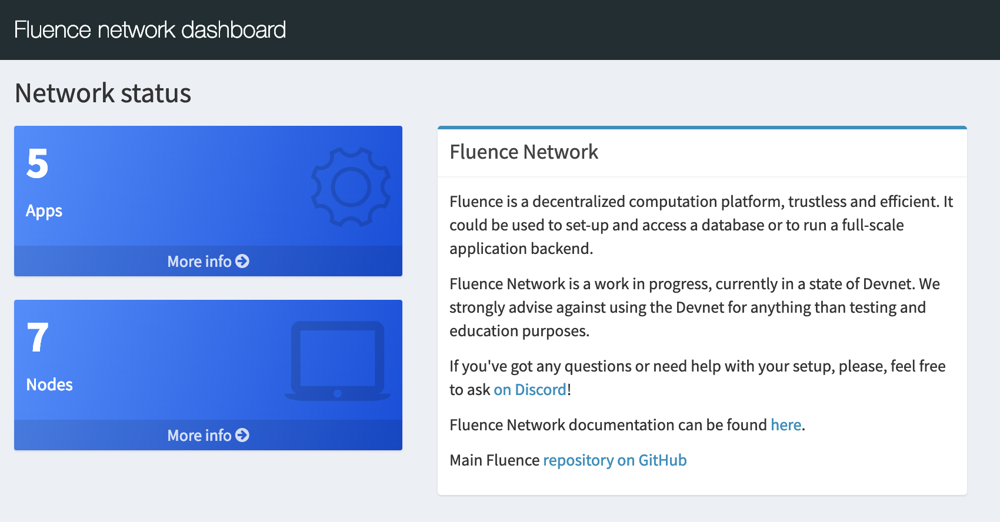
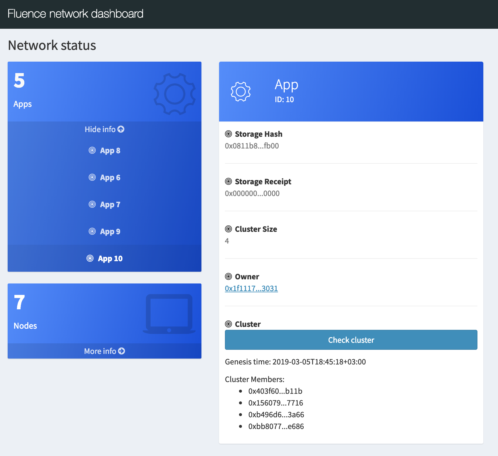
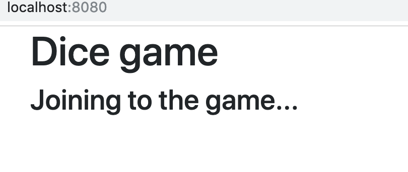
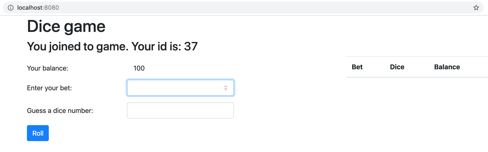

# Dice game
- [Set up Rust](#set-up-rust)
- [Understand existing code](#understand-existing-code)
- [Implement requests handling](#implement-requests-handling)
- [Compiling Rust to WebAssembly](#compiling-rust-to-webassembly)
- [Publishing](#publishing)
- [Dashboard](#dashboard)
- [Dice game frontend](#dice-game-frontend)
  - [package.json](#packagejson)
  - [index.js](#indexjs)
    - [JS SDK: invoke(), result()](#js-sdk-invoke-result)
    - [JS SDK: connect()](#js-sdk-connect)
    - [Game: join()](#game-join)
    - [Game: roll()](#game-roll)
  - [Running the app](#running-the-app)
- [Hacking!](#hacking)
    - [Frontend](#frontend)
    - [Backend](#backend)

In this simple dice game, you can bet your points against dice rolled by the backend. 

Backend handles user registration, balances and dice generation, and frontend gives the end-user an interface to play the game.

Backend will be developed in Rust, because of it's tremendous WebAssembly support. And for the frontend, JavaScript and some HTML will do. (With some TypeScript under the hood 😉)

## Set up Rust

Install the Rust compiler:
```bash
# installs the Rust compiler and supplementary tools to `~/.cargo/bin`
~ $ curl https://sh.rustup.rs -sSf | sh -s -- -y
info: downloading installer
...
Rust is installed now. Great!
To configure your current shell run source $HOME/.cargo/env
```

Let's listen to the installer and configure your current shell:
```bash
~ $ source $HOME/.cargo/env
<no output>
```

After that, we need to install the nighly Rust toolchain:  
<small>(Fluence Rust SDK requires the nightly toolchain due to certain memory operations)</small>
```bash
~ $ rustup toolchain install nightly
info: syncing channel updates ...
...
  nightly-<arch> installed - rustc 1.34.0-nightly (57d7cfc3c 2019-02-11)
```

Let's check that the nightly toolchain was installed successfully:
```bash
~ $ rustup toolchain list | grep nightly
# the output should contain the nighly toolchain
...
nightly-<arch>
```

To compile Rust to WebAssembly, we also need to add the `wasm32` compilation target:
```bash
# install target for WebAssembly
~ $ rustup target add wasm32-unknown-unknown --toolchain nightly
info: downloading component 'rust-std' for 'wasm32-unknown-unknown'
info: installing component 'rust-std' for 'wasm32-unknown-unknown'
```

Finally, let's check that everything was set up correctly and compile a sample Rust code:
```bash
# create a simple program that always returns 1
~ $ echo "fn main(){1;}" > test.rs

# compile it to WebAssembly using rustc from the nightly toolchain
~ $ rustup run nightly rustc --target=wasm32-unknown-unknown test.rs
<no output>
# check that the test.wasm output file was created
~ $ ls -lh test.wasm
-rwxr-xr-x  1 user  user   1.4M Feb 11 11:59 test.wasm
```

Now it's time to create a Rust dice-game project! For that, clone this repository, and open `dice-game/backend` directory:
```bash
$ git clone https://github.com/fluencelabs/tutorials
$ cd tutorials/dice-game/backend/src
```

## Understand existing code

As most of the game is already implemented in the [`GameManager`](backend/src/game_manager.rs), your task will be to handle users' interaction: route their requests, handle errors, and bring the game to life! All this should be done inside [`lib.rs`](backend/src/lib.rs) file. 

Open `lib.rs` in your favorite text editor, and you will see the following code:

```Rust
// Describe modules used in the backend
mod error_type;
mod game_manager;
mod request_response;

// Import needed libraries
use crate::error_type::AppResult;
use crate::game_manager::GameManager;
use crate::request_response::{Request, Response};

use fluence::sdk::*;
use serde_json::Value;
use std::cell::RefCell;

// Define game settings
mod settings {
    pub const PLAYERS_MAX_COUNT: usize = 1024;
    pub const SEED: u64 = 12345678;
    // the account balance of new players
    pub const INIT_ACCOUNT_BALANCE: u64 = 100;
    // if win, player receives bet_amount * PAYOUT_RATE money
    pub const PAYOUT_RATE: u64 = 5;
}
```

This snippet imports needed modules and crates (libraries), and also defines the `settings` module with different game constants.

Most of the game logic is implemented inside [`GameManager`](backend/src/game_manager.rs). It maintains a hash map with users and their balances stored in [insertion order](https://contain-rs.github.io/linked-hash-map/linked_hash_map/index.html). This hash map contains up to `PLAYERS_MAX_COUNT` players, and the oldest player is deleted if limit is exceeded.

`GameManager` has three public functions: 
- `join` - creates new player, returns it's `player_id`.
- `roll` - makes a bet with `player_id`, `bet_placement`, `bet_size`, returning an outcome and a player's balance.
- `get_player_balance` - returns the balances for the player specified by `player_id`.

We need to create a `GameManager` instance to store a game state. As the game state should be persisted between calls, `GameManager` should be a global variable. Since Wasm environment is single-threaded, `thread_local!` macro is used here for the global state storage.

<small>Paste this snippet to the [`lib.rs`](backend/src/lib.rs):</small>
```Rust
thread_local! {
    static GAME_MANAGER: RefCell<GameManager> = RefCell::new(GameManager::new());
}
```

`RefCell` here is needed to provide interior mutability since `thread_local!` assume that its content is immutable. It's a technical detail.

## Implement requests handling

_You can find full working example in the [`lib.rs.full`](backend/src/lib.rs.full) file._

There are `Request` and `Response` enums in the [`request_response.rs`](backend/src/request_response.rs) that could be serialized and deserialized by JSON framework named `serde`. 

These enums are to be used to parse requests and send back reponses. With the great power of `serde_json` routing can be easily implement via pattern matching.

<small>Paste this snippet to the [`lib.rs`](backend/src/lib.rs):</small>
```Rust
fn do_request(req: String) -> AppResult<Value> {
    let request: Request = serde_json::from_str(req.as_str())?;

    match request {
        Request::Join => GAME_MANAGER.with(|gm| gm.borrow_mut().join()),

        Request::Roll {
            player_id,
            bet_placement,
            bet_size,
        } => GAME_MANAGER.with(|gm| gm.borrow_mut().roll(player_id, bet_placement, bet_size)),

        Request::GetBalance { player_id } => {
            GAME_MANAGER.with(|gm| gm.borrow_mut().get_player_balance(player_id))
        }
    }
}
```

So, we have requests parsing and routing implemented! Great, now we need to tell Fluence how to call our code. For that, we need to mark some function with `#[invocation_handler]` macro. Let's call it `main`:
```rust
#[invocation_handler]
fn main(req: String) -> String
```

The function marked with the `#[invocation_handler]` macro is called a _gateway function_. It is essentially the entry point to your application: all client transactions will be passed to this function, and once it returns a result, clients can read this result. 

Gateway functions are allowed to take and return only `String` or `Vec<u8>` values, and `String` seems like a better fit for a JSON-based protocol, so we'll go with that. 

`do_request` returns a `Result`, possibly with errors, let's convert it to a `String`.

<small>Paste this snippet to the [`lib.rs`](backend/src/lib.rs):</small>
```rust
#[invocation_handler]
fn main(req: String) -> String {
    match do_request(req) {
        Ok(res) => res.to_string(),
        Err(err) => {
            let response = Response::Error {
                message: err.to_string(),
            };
            serde_json::to_string(&response).unwrap()
        }
    }
}
```

Finally, we have a `main` function that can receive JSON as a `String`, process it by `do_request`, and return a JSON string.

## Compiling Rust to WebAssembly

To build the `.wasm` file, run this from the application directory:  
<small>(note: downloading and compiling dependencies might take a few minutes)</small>

```bash
# in directory dice-game/backend/src
$ cargo +nightly build --target wasm32-unknown-unknown --release
    Updating crates.io index
    ...
    Finished release [optimized] target(s) in 1m 16s
```

If everything goes well, you should have a `.wasm` file deep in `target`. Let's check it:
```bash
# in directory dice-game/backend/src
$ ls -lh ../target/wasm32-unknown-unknown/release/dice_game.wasm
-rwxr-xr-x  2 user  user  1.4M Mar 5 00:00 target/wasm32-unknown-unknown/release/dice_game.wasm
```

## Publishing
Let's refer to the [Fluence Book](https://fluence.network/docs/book/quickstart/publish.html) to guide us through the publishing process.

## Dashboard
After a successful publishing, you now have a deployed backend app with assigned `appId`. To check that's your application is created a healhy cluster, open [dash.fluence.network](http://dash.fluence.network). You will see

<div style="text-align:center">
<kbd>

</kbd>
<br><br><br>
</div>

Click `Apps`, find an App with your `appId` in the list, and click it.

<div style="text-align:center">
<kbd>

</kbd>
<br><br><br>
</div>

Click the `Check cluster` button, and you will see the height of a blockchain for every member of the cluster. If everything is fine, the height should be bigger that `1`, equal between cluster members, and marked green.

<div style="text-align:center">
<kbd>

</kbd>
<br><br><br>
</div>

The height will increase when you send a request to the backend app. 

If everything is OK, let's move to the frontend!

## Dice game frontend
_For this part, you will need installed `npm`. Please refer to [npm docs](https://www.npmjs.com/get-npm) for installation instructions._

Having a [Rust backend](#implement-requests-handling) for the Dice game, the next logical step is to provide potential users with a web interface for the game. 

Let's open `dice-game/frontend` directory:
```bash
# from dice-game/backend/src
$ cd ../../frontend
```

There are two files of interest in `dice-game/frontend`:
- [`package.json`](frontend/package.json) that declares needed dependencies
- [`index.js`](frontend/index.js) that imports `fluence` js library and shows how to connect to a cluster

### package.json
Fluence JS SDK is specified as a dependency along with `bootstrap`:
```json
  "dependencies": {
    "fluence": "0.1.16",
    "bootstrap": "4.3.1"
  }
```

You can find the latest version on [npmjs.org](https://www.npmjs.com/package/fluence).

### index.js
Now let's look at the [`index.js`](frontend/index.js).

First, we import Fluence JS SDK, and define two helper functions:
```js
import * as fluence from "fluence";
...
// save fluence to global variable, so it can be accessed from Developer Console
window.fluence = fluence;

// convert result to a string
window.getResultAsString = function (result) {
	return result.result().then((r) => r.asString())
};

window.logResultAsString = function(result) {
	return getResultAsString(result).then((r) => console.log(r))
};
```

#### JS SDK: invoke(), result()
Main method in Fluence SDK is `invoke`, it takes a string, and returns an object similar to promise. Object has a method called `result`. Responses are lazy in Fluence, and `result` retrieves the response of a specific `invoke` from the real-time cluster.

So methods `getResultAsString` and `logResultAsString` are to automate calling `result`, and save some typing. It's not always a good idea to call `result` on every invoke, because result is available only after two Tendermint blocks, so it can take a while. Sometimes a better approach would be to send a batch on `invoke`'s, and then call `result` as you need.

#### JS SDK: connect()

Next, connect to the Fluence real-time cluster hosting the app:
```javascript
// address to Fluence contract in Ethereum blockchain. Interaction with blockchain created by MetaMask or with local Ethereum node
let contractAddress = "0x074a79f29c613f4f7035cec582d0f7e4d3cda2e7";

// set ethUrl to `undefined` to use MetaMask instead of Ethereum node
let ethUrl = "http://data.fluence.one:8545/";

// application to interact with that stored in Fluence contract
let appId = "10";

// create a session between client and backend application, and then join the game
fluence.connect(contractAddress, appId, ethUrl).then((s) => {
    console.log("Session created");
    window.session = s;
}).then(() => join());
```

Let's move from SDK API to the actual game interface implementation!

#### Game: join()
`join()` sends a request with `{ "action": "Join" }` inside, and then changes some UI elements:
```javascript
// send request to join the game
function join() {
    let result = session.invoke(`{ "action": "Join" }`);
    getResultAsString(result).then(function (str) {
        let response = JSON.parse(str);
        ...
        updateBalance(100);
        startGame(response.player_id);
        ...
    });
}
```

#### Game: roll()
Then we set a callback on roll button to make a bet, and roll the dice by sending a request to the backend:
```javascript
// call roll() on button click
rollButton.addEventListener("click", roll);

// roll the dice by sending a request to backend, show the outcome and balance
function roll() {
    ...
    let request = betRequest();
    let result = session.invoke(request);
    getResultAsString(result).then(str => {
        let response = JSON.parse(str);
        ...
        showResult(parseInt(response.outcome), guess);
        saveGame(bet, response);
        ...
    });
}
```

`roll()` sends the following `Bet` request:
```js
{
    "action": "Bet",
    "player_id": globalInfo.player_id,
    "placement": guess,
    "bet_amount": parseInt(bet)`
}
```

There are few helper functions that build a JSON request, validate user input, and update UI in different ways:
```js
// build a bet JSON request from inputs
function betRequest() { ... }

// check inputs are valid, and report if they're not
function checkInput() { ... }

// display results in UI
function showResult(fact, guess) { ... }

// prepend game results to the game history table
function saveGame(bet, response) { ... }

// update balance in UI
function updateBalance(balance) { ... }
```

### Running the app
After putting it all together, let's run it:

```bash
# in directory dice-game/frontend
frontend $ npm install
frontend $ npm run start
> frontend-template@1.0.0 start /private/tmp/frontend-template
> webpack-dev-server

ℹ ｢wds｣: Project is running at http://localhost:8080/
...
```

Open [http://localhost:8080/](http://localhost:8080/), and you will see a joining screen:

<div style="text-align:center">
<kbd>

</kbd>
<br><br><br>
</div>

And shortly after that, a betting screen:

<div style="text-align:center">
<kbd>

</kbd>
<br><br><br>
</div>

Let's make a bet!

<div style="text-align:center">
<kbd>

</kbd>
<br><br><br>
</div>


You can press `Ctrl-C` now to kill the web server.

## Delete your backend
After you've done with your backend, you can delete it!

You should already have a CLI available in your terminal, so let's use it:
```bash
# in directory dice-game/frontend
$ cd ../backend/src
$ ./fluence delete_app --wait --deployed --app_id <your app id>

```

Note the `--deployed` option. It means that app is deployed and the cluster hosting it should be deleted as well. Without that flag, app would be removed only if there is no assigned cluster (i.e., app is not yet deployed).

## Hacking!
Ideas to implement:
#### Frontend
- Add leaders board

You can use `GetBalance` method:
```js
{ "player_id": ${id}, "action": "GetBalance"}
```
- Ability to resume game after a page reload

#### Backend
- Add names support (instead of ids or whatnot)
- Add game history support
