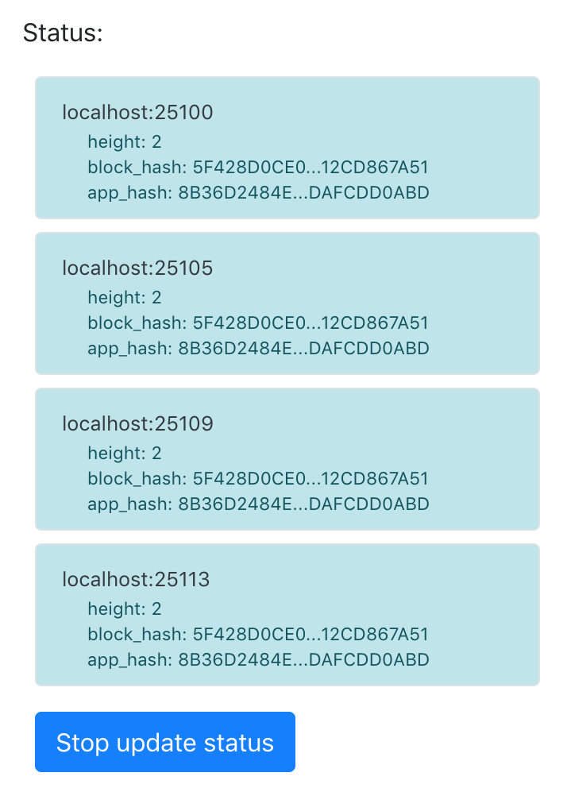
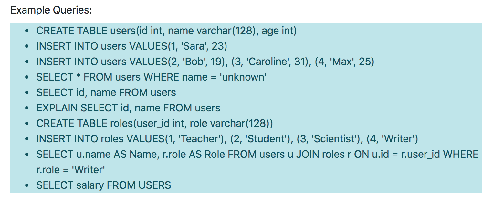
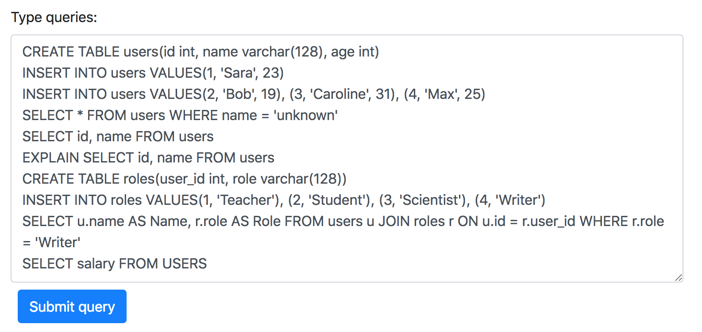
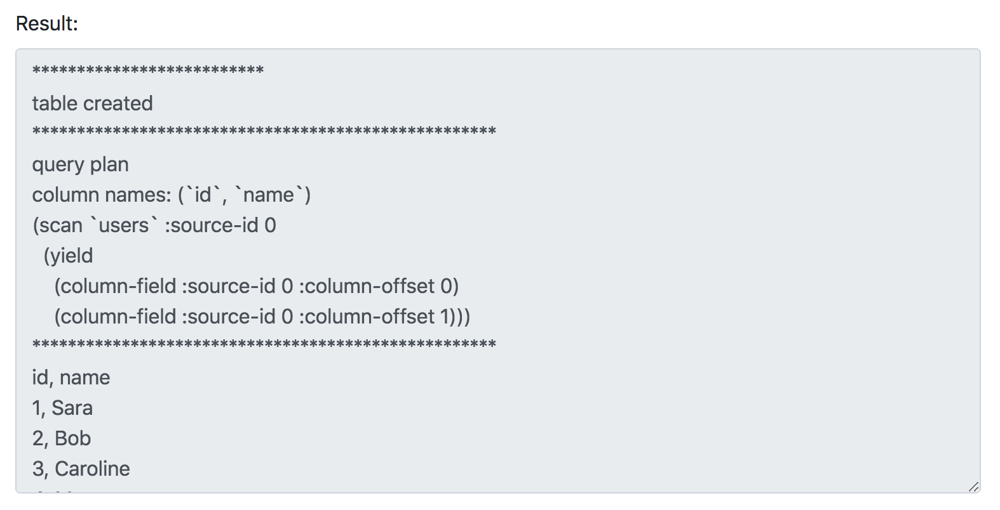
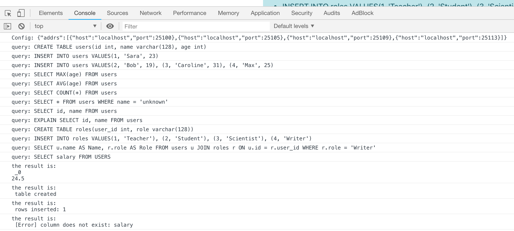

# Llamadb Showcase
In this example, we'll look at how to use simple SQL database deployed to Fluence.

## Llamadb
Llamadb is a Rust-written simple SQL database, that with few modifications was compiled to Wasm and deployed to Fluence Devnet

## Already published
Devnet already hosts an instance of Llamadb. As it's available to everyone, it's data is shared, and there's no privacy. Just simplicity and decentralization.

Llamadb has an `appId = ??? TODO`.

## But you can publish too
If you want your own instance of Llamadb, you can publish it. It would still be accessible by everyone as there's not authtorization by default.

You can either use [prebuilt Wasm binary](llama_db.wasm) Please refer to [Fluence CLI README](TODO) for instructions on how to publish an app to Fluence.

## Using it
**You will need Node.js and git installed.**

We'll use existing Llamadb on `appId = ??? TODO`.

### Set appID
TODO: add appId input box to the webpage, also add input box for ethereum url, so user can use their own node or switch to metamask.
TODO: add screenshots of the process

### Run

Go to this directory (`fun/llamadb`) in your terminal, and start web app:
```
~ $ cd fun/llamadb
llamadb $ npm install
llamadb $ npm start run
...
> webpack-dev-server

ℹ ｢wds｣: Project is running at http://localhost:8080/
ℹ ｢wds｣: webpack output is served from /
...
```
Open [http://localhost:8080/](http://localhost:8080/), and you will see real-time nodes' statuses on the left:
<div style="text-align:left">
<br>

<br><br><br>
</div>

You can copy all queries from the `Example queries` block to the `Type queries` block:
  


Push the `Submit query` button:
  


Wait for the result in the `Result` block:
  


You can see logs of what's happening in the web console:
  


## BUIDL
Now that you're have a general-purpose SQL database, you can try to build some applications with it!

A few ideas:
- REST API. Implement PUT, UPDATE, DELETE & GET methods, and give other opportunity to stand on your shoulders building their DApp!
- Curated rating list. Anyone can add a topic, add items to the topic, and vote for rating. Be it a Top Movies list, or a Curated Token Registry :) Don't forget to show resulting list to your users.
- Analytics streaming. Accept a stream of analytics data, e.g., about air pollution, store it, and calculate some aggregations on that data to answer users' questions about stored data.
